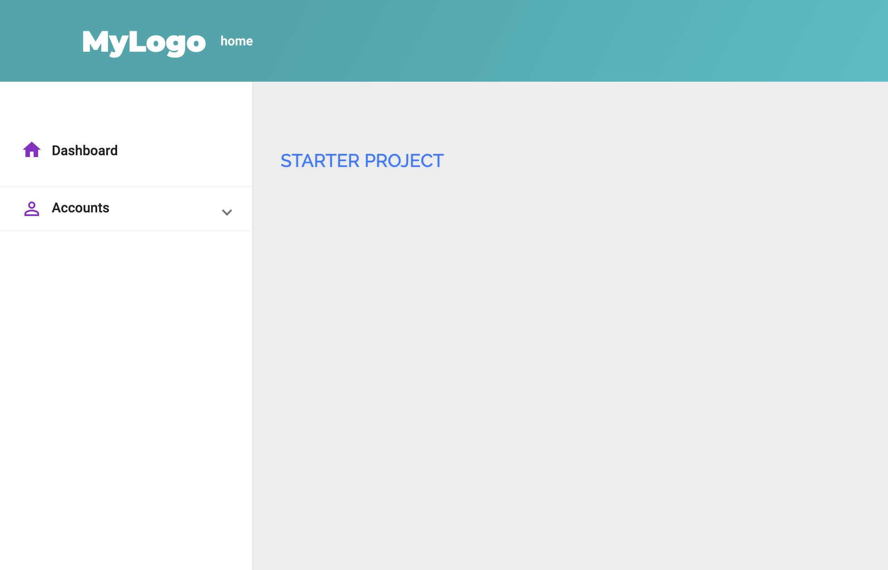

# Starter project

This project was generated with [Angular CLI](https://github.com/angular/angular-cli) version 7.1.4.



Angular Starter project is a starting point for your next Angular dashboar project. 
The project is built with Angular Material (https://material.angular.io/) and follows Google best practices.

## Main Project stracture

```
- App
|------- Common // holds common and shared modules, services and components
|        |
|        |------ modules
|        |------ components
|        |------ services
|        |------ guards
|        |------ interfaces
|        |
|        |- app-shared.module.ts // importing shared components, pipes etc.
|        |
|        |- material-shared.module.ts // imprting all material modules needed for the project
|
|------- Pages // holds domain modules, main "pages" of the system, for example: Dashboard page
|
|- app.routing.module.ts  // the main routing module that loads each child route
|- app-context.service.ts // the single source of truth in the system. AppContext is the app state. 

## AppContext
AppContext is declaring BLs (business logic) that later are binded in the parent module of the BL. 
BL state can then be reffered from AppContext using Getter/Setter: 
```

```
// AppContext.ts

...

get User() {
   return this.userBl.User; // also a getter
}
```


## Development server

Run `ng serve` for a dev server. Navigate to `http://localhost:4200/`. The app will automatically reload if you change any of the source files.
If you want to run without reload, use the following: `ng serve --live-reload=false`

Don't forget to run `npm install` first. 

## Build

Run `ng build` to build the project. The build artifacts will be stored in the `dist/` directory. Use the `--prod` flag for a production build.
